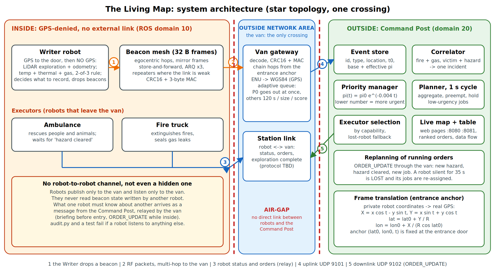

# The Living Map: spatial memory for emergency robots (IEEE TSYP14, Fire / Hazardous Building, one floor)

A **Writer** robot drives to the entrance of a GPS-denied burning building **by GPS**, then explores the interior without GPS and drops 32-byte radio beacons. A **van** (Outside Network Area) is the only link between inside and outside: it decodes the beacons, converts their private coordinates to GPS and forwards them to the **Command Post**, which ranks the events, groups related ones into single orders and briefs the **Executor** robots (ambulance, fire truck). Robots never talk to each other or to the Command Post directly.



## Run it (Ubuntu 24.04, ROS 2 Jazzy, Gazebo Harmonic)
The default map is the **one-floor building** (`maps/complex_1floor.json`, 48 x 24 m: 2 fires, a gas leak, a steam source, 2 people, an animal, rubble). Put the folder at `~/living_map_ws`.
```bash
cd ~/living_map_ws && source /opt/ros/jazzy/setup.bash && colcon build --symlink-install
bash src/living_map_core/scripts/run_clean.sh speed:=1 2>&1 | tee ~/launch.log      # full system: ROS 2 + Gazebo + RViz
bash src/living_map_core/scripts/check_run.sh                                      # after about 60 s
```
A mission lasts about 384 simulated seconds; use `speed:=3` to see it in about 2.1 minutes.
Pages: `http://localhost:8081` simulation, `http://localhost:8080` Command Post, `http://localhost:8081/flow` data flow and beacon table.
Without ROS: `cd src/living_map_core && python3 -m living_map_core.standalone --speed 3`. Gazebo world alone: `gz sim -r -v 2 src/living_map_core/worlds/complex_1floor.sdf`.
The Phase 2 prototype arena (7.2 x 4.8 m, buildable in plywood): add `map:=$HOME/living_map_ws/src/living_map_core/maps/proto_arena.json`.
Tests: `cd src/living_map_core && python3 -m pytest test/test_core.py -q`.

## Results (simulation of the building, 10 seeds; `python3 tools/collect_final.py`)
| measure | value |
|---|---|
| events detected / false records | recall 100 % / 0 false records in 10 runs |
| target position error | 0.42 m mean, 1.38 m max (by kind: animal 0.22 m, fire 0.29 m, gas 1.27 m, human 0.21 m) |
| beacons | 20.8 per run (7 events + 13.8 relays), 100 % delivered, delivery delay below one second |
| orders | 4.0 orders and 6.0 order updates for 7 event beacons; 20.7 uplink messages (immediate) or 6.0 (batched) |
| fires out / victims rescued | all runs (2 of 2) / 2 of 3: the victim sealed behind rubble is flagged up-front in 10 of 10 runs and handed to the human team |
| first person: blind Executor / briefed Executor / end to end | 172 s / 76.3 +/- 7.6 s / 302.9 +/- 6.4 s |
| timeline (mean of 10 runs) | Writer reaches the door by GPS in 3.5 s; first order at 50 s (fire truck, gas leak); ambulance leaves at 227 s; Writer finishes at 284 s; fires out at 287 s; mission 384.5 +/- 6.9 s |
| faults (3 seeds) | beacon destroyed: reported 16 s later, mission unchanged; **Writer lost at 150 s: 0 of 2 fires out in every run, 1.0 of 3 rescued** |
| radio attenuation (2 seeds per level) | fine at 12 and 24 dB per wall; **at 30 dB one seed fails completely** (0 of 2 fires out, nothing rescued) |
| navigation: direct A* vs replaying the trail (4 seeds) | first person 72 vs 122 s, distance 284 vs 319 m, busy time 309 vs 403 s |
| hold rule (3 seeds) | the ambulance leaves at 228 s with the rule and at 87 s without it (it no longer leaves for an animal before a person is known); mission 384 s vs 337 s; victims rescued 2.0 vs 2.0 |
| simulation speed | 37 times faster than real time |
| Phase 2 prototype arena (10 seeds) | recall 100 %, 0.27 m error, 3 of 4 rescued, mission 116.5 +/- 36.2 s; blind 9 s vs briefed 6.5 s; direct A* is longer than the trail there (131 vs 110 m); every mission completes up to 30 dB per wall |

**Read the timing honestly.** On the building a blind Executor needs 172 s to reach a person; a briefed one needs 76 s (56 % less). But end to end the first person is reached after 303 s, because the Writer must explore first (the first reachable person is found at about 224 s in the traced run): the chain is **slower than a lucky blind search**. Its value is that no robot searches blind inside a hazard, that one Writer pass serves every Executor, that the gas leak is sealed and the fires are known before a robot enters, that a sealed victim is handed to the human team, and that the memory survives the Writer, except for what the Writer has not yet seen (see the Writer-lost fault).

## Where to read more
| File | Content |
|---|---|
| `REPOSITORY_GUIDE.md` | architecture and the content of every file |
| `src/living_map_core/docs/ARCHITECTURE.md` | modules, ROS graph, message schemas, rules the code enforces |
| `src/living_map_core/docs/FAILURE_CASES.md` | five failure cases with measured results |
| `src/living_map_core/docs/PHASE2_IMPLEMENTATION_PLAN.md` | timeline, bill of materials, physical test protocol |
| `src/living_map_core/docs/PROTOTYPE_ARENA.md` | the plywood arena and the specification check |
| `CHANGELOG.md` | what changed between versions, including fixed measurement errors |
| `TROUBLESHOOTING.md` | when something does not start |

## Limits (read before you trust a number)
All results are from the simulator, which runs the same code as the ROS 2 nodes. Radio loss, GNSS error, sensor noise and thermal behaviour are assumed values to be measured on hardware. The robot-to-van link is an ideal channel (protocol to be defined). The Gazebo world is generated from the same map and has been validated only as well-formed XML. The code also supports several floors (stairs, a drone role), which is outside the evaluated one-floor scope.
