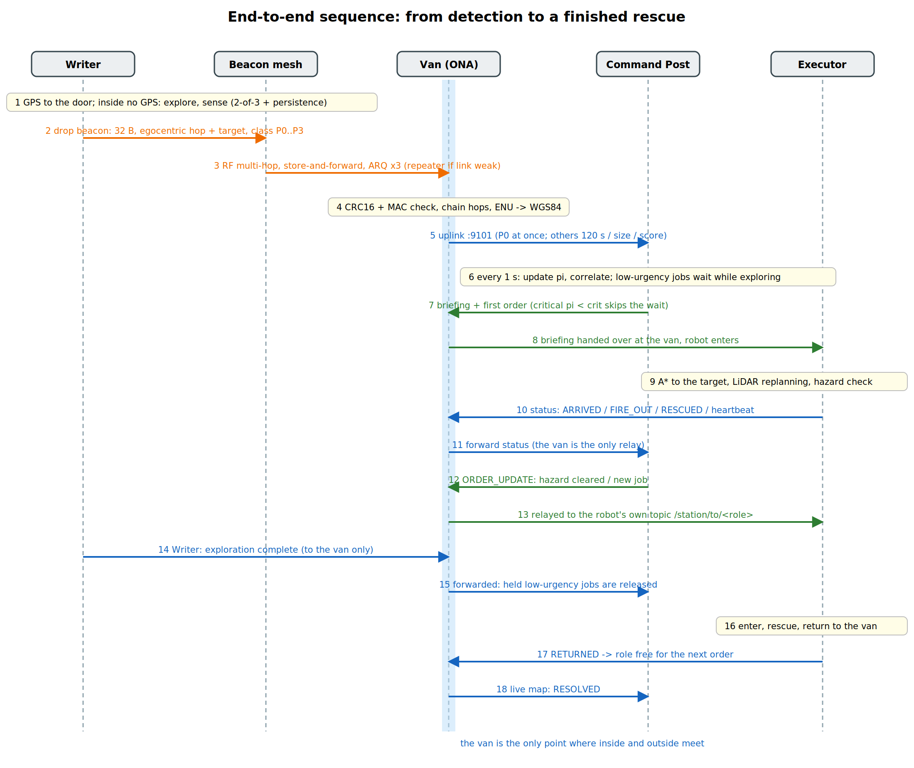
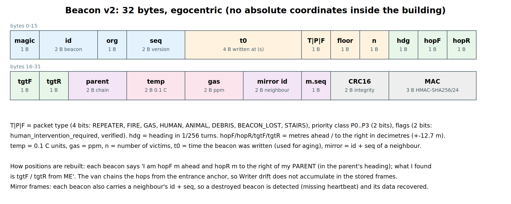

# Architecture, modules and message schemas





## Modules (`living_map_core/`)
| File | Role |
|---|---|
| `beacon_protocol.py` | 32-byte beacon v2, CRC16 + MAC, egocentric geometry, priority and confidence maths |
| `geo.py` | entrance anchor: local ENU <-> WGS84 with uncertainty |
| `sim_core.py` | world from `maps/*.json`, sensors, RF model, multi-floor A* planner |
| `agents.py` | `WriterAgent`, `Detector`, `Mesh` (store-and-forward, ARQ), `GatewayCore` (the van), `StationLink` |
| `adaptive_queue.py` | uplink queue: P0 at once, else 120 s / size / score |
| `command_post.py` | event store, priority, correlation, 1 s decision cycle, orders, replanning, robot health |
| `roles.py` | Executors: ambulance and fire truck (A*, job ordering, hazard handling); a drone role exists for multi-floor buildings and is idle on one floor |
| `simulation.py`, `standalone.py`, `viewstate.py` | one-process simulator and the web pages (no ROS needed) |
| `nodes.py` | ROS 2 nodes (thin wrappers) |
| `audit.py` | checks that no robot listens to anything but its van topic |
| `gz_world.py` | Gazebo SDF generator from the map |

## ROS 2 graph
* Domain 10 (inside): `writer`, `beacon_mesh`, `outside_network_gateway` (the van), `ambulance`, `firetruck`, `sim_view`, `gz_bridge` (a `drone` node exists for multi-floor maps).
* Domain 20 (outside): `command_post`.
* Crossings: UDP uplink `127.0.0.1:9101` (van to Command Post), UDP downlink `127.0.0.1:9102` (Command Post to van), briefing files `/tmp/living_map/mission_<role>.json`.
* Topics: `/station/from/<role>` (robot to van only), `/station/to/<role>` (van to robot only), `/beacon_write`, `/beacon_state`, `/world/action` (simulator physics).

## Messages
**Station message robot -> van** (`StationLink.KINDS`): `STATUS`, `FIRE_OUT`, `RESCUED`, `RETURNED`, `LOW_BATTERY`, `ARRIVED`, `UNREACHABLE`, `BEACON_UPDATE`, `HAZARD_CLEARED`, `EXPLORATION_DONE` (sent by the Writer).
```json
{"robot": "ambulance", "kind": "RESCUED", "payload": {"bid": 9, "id": "BCN_009"}, "t": 133.5}
```
**Uplink van -> Command Post**
```json
{"reason": "IMMEDIATE", "sent_t": 41.5, "records": [{"id": "BCN_006", "type": "GAS", "prio": 0, "floor": 0, "n": 1, "lat": 36.80649, "lon": 10.18158, "tlat": 36.80649, "tlon": 10.18159, "sigma_m": 0.5, "t0": 40, "hop_text": "3.0 m ahead, 1.2 m right of the entrance"}]}
```
**Briefing** (`mission_<role>.json`, handed over at the van before entry)
```json
{"role": "firetruck", "issued_at": 48.0, "anchor": {"lat0": 36.8065, "lon0": 10.1815, "yaw_deg": 45.0},
 "targets": [{"id": "BCN_006", "type": "GAS", "prio": 0, "floor": 0, "lat": 36.80649, "lon": 10.18158, "pi": 0.893, "incident": "INC-6", "chain": [], "order": "OP-1"}],
 "hazards": [{"bid": 6, "type": "GAS", "radius": 3.0}], "stairs": [], "debris": [], "skipped": []}
```
**ORDER_UPDATE** (Command Post -> van -> robot, while the robot is inside)
```json
{"role": "ambulance", "kind": "ORDER_UPDATE", "t": 101.5, "payload": {"cleared": [2], "hazards": [], "wait_for": {}, "targets": []}}
```
**Event record** (`CommandPost.events()`): `event_id, type, location{floor,lat,lon,x,y}, detected_at, priority_base, priority, required_capabilities, status, assigned_robot, related_events, incident`.

## Rules the code enforces
1. No robot-to-robot link; robots listen only to `/station/to/<role>` (`audit.py`, test `test_audit_forbids_robots_reading_beacon_state`).
2. Priority number: 0 to +infinity, lower is more urgent, `pi(t) = pi0 * exp(-0.004 t)`, age counted from the detection time.
3. The Command Post decides once per cycle (default 1 s), not once per event; related events share one order.
4. A critical event (priority number below 0.3) skips the collection wait; running orders are updated through the van.

## Writer phases and the van (v4_13)
* **Outdoors (GPS):** the Writer starts at the van (`writer_start` in the map, default (-3.0, -1.2) m) and drives to the entrance door by GNSS (noisy fixes, sigma 0.8 m, assumed); in the last 2.5 m the LiDAR finds the door gap. No odometry drift accumulates and nothing is beaconed outdoors.
* **At the door:** GPS is lost. The private frame is anchored on the last GNSS fix (the anchor `lat0, lon0, yaw0` of the map); from here LiDAR + odometry only, with drift.
* **The van** is a small gateway vehicle outside the building: `van_size` [length, width, height] in the map JSON (default 2.6 x 1.3 x 1.4 m, the prototype arena uses a 0.9 x 0.6 x 0.5 m table-top gateway). It is the Outside Network Area; the Command Post is a separate station further outside, linked to the van only.

## Dispatch rule for low-urgency jobs (v4_14)
A job whose priority number is worse than `hold_above` (computed from the priority table: the least urgent life-threatening event at class P1) does not send a robot out while the Writer is exploring. It is released by priority aging, or at once on `EXPLORATION_DONE`. Nothing in this rule names a robot or an event type.
